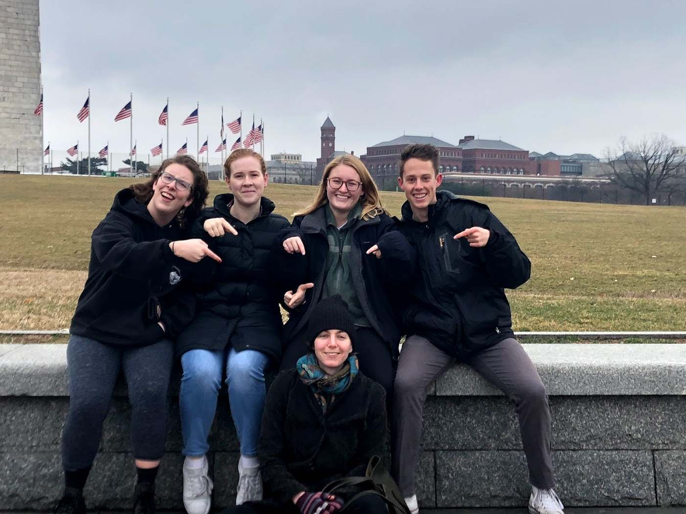

<h1 style="text-align:center">Education</h1>

__University of Wisconsin - Madison__  
Bachelor of Science in Computer Science, Communication Arts (Communication Science and Rhetorical Studies)  
_September 2016 - May 2020_

### Courses

| Computer Science | Communication Arts | Other |
|------------------|--------------------|-------|
| <ul> <li>Algorthims</li> <li>Calculus 1, 2, and 3</li> <li>Computer Engineering (LC-3 Assembly)</li> <li>Data Management for Data Science (Python, SQL)</li> <li>Data Structures (Java) <li>Distcrete Mathematics</li> <li>Linear Algebra</li> <li>Machine Organization (C, x86 Assembly, Bash)</li> <li>Operating Systems (C, Bash)</li> <li>Programming (Java)</li> </ul> |<ul> <li>Argumentation & Debate</li> <li>Critical Internet Studies</li> <li>Communication & Human Behavior</li> <li>Contemporary Political Discourse</li> <li> Demagogues, Dictators, & Extremists</li> <li>Great Speakers & Speeches</li> <li>Nature of Criticsm</li> <li>Theory & Practice of Persuasion</li> </ul>|<ul> <li>Cultural Anthropology</li> <li>History of Science</li> <li>HIV & Society</li> <li>Modern Physics</li> <li>Appearence & Reality (Philosophy)</li> <li>Shakespeare</li> <li>University Band (4 Semesters)</li> </ul>       |

<h2 style ="text-align:center">Extracurriculars</h2>

###Ethics Bowl

I currently am a member and former team captain of the UW-Madison Ethics Bowl Debate Team, sponsored by the [Holtz Center](https://sts.wisc.edu/2018/09/04/holtz-center-sponsors-uw-madison-ethics-bowl-team/). We placed [3rd in 2017](https://sts.wisc.edu/2017/12/05/uw-madison-ethics-bowl-team-headed-to-nationals-in-march/) and 1st in 2018 at the Upper Midwest Regionals, and particpated in Nationals in 2018 and 2019.

 
Ethics Bowl is a form of debate run by The Association for Practical and Professional Ethics (APPE) where students from all over the country come together to defend practical ethical stances on issues ranging from automation to genetics. The program encourages impromptu speaking as well as critical thinking and team work. Each year, the top 32 teams from over 15 regionals around the country particpate in Nationals to be the best team in the country.  
[The Team's WIN Page](https://win.wisc.edu/organization/e-bowl)  
[The Team's Facebook Page](https://www.facebook.com/groups/1867389600177091/)

### CASA
I particpated in the Communication Arts Student Association (CASA) from January 2017 to May 2018. During that time, I spent a year as the Academic Chair of the student organization. I managed the relationship between the organzation and the department and shaped the image of the major projected to students inside and outside the department.  

[CASA WIN Page](https://win.wisc.edu/organization/casa)  
[CASA Facebook Page](https://www.facebook.com/CASAUW/)
