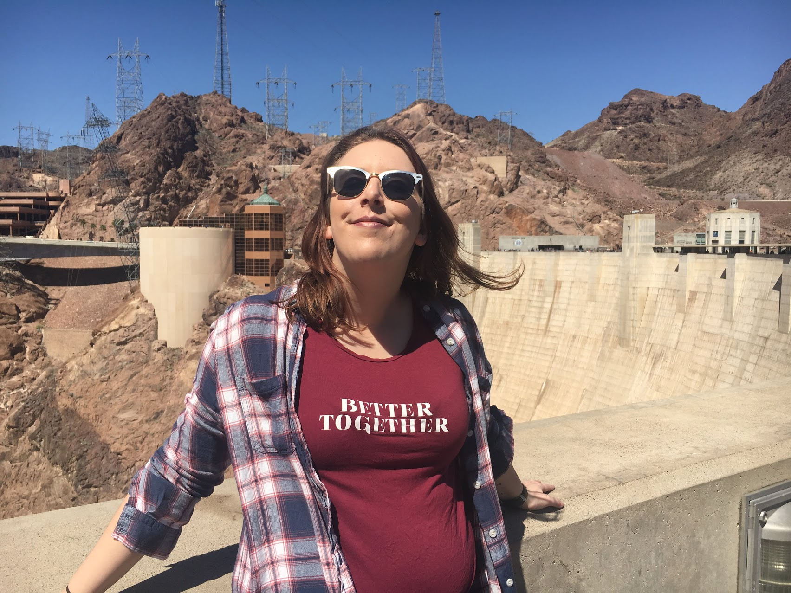

<h1 style="text-align:center">Sara Rabon</h1>

 I am a young woman working hard to get my Bachelor of Science in computer science and communications at UW-Madison. This summer, I have been interning at 3M in Minnesota and have been working specifically with data migration. My interest spread from back-end development and data science to public speaking and rhetorical studies. I believe strongly in being well rounded, so I constantly work to learn and grow inside my studies and outside in other opportunities.

___

## Work Experience

__IT Intern on the MDM: Data Migration Team__  
__3M__  
St.Paul, MN   
_May 2019 - Present_  

__Undergraduate Research Assistant__  
__Center for Healthy Minds__  
Madison, WI  
_September 2018 - Present_  
I spend most of my time at the Center creating psych tasks online for experiments and research. The Center has switched to new psych software recently, so it has been my job to transform old tasks to fit in the new software. On top of that, I also work to create new ways to teach the software to unfamiliar employees. Once experiments have been run, I have written numerous scripts to clean and analyze large amounts of data gathered from the experiments. 

__Student IT Technician__  
__UW-Madison Science Hall Help Desk__  
Madison, WI  
_Feburary 2019 - Present_  
Working for the service desk at Science Hall has me opening and answering tickets for students and faculty in the building. Each ticket request allows me to test and grow my computer science skills. During downtime, I would work on replacing parts and setting up lab computers.

__Sales Supervisor__  
__Event Network, Inc.__  
St.Paul, MN  
_May 2017 - August 2017_  
Moving to a more managerial position was a natural progression from my time at Ace Hardware. I opened and closed the store several days a week while keeping track of inventory and employees during the day. Since I was contracted to work at a seasonal exhibit for the Science Museum of Minnesota, I engaged with a wide array of ages and enjoyed learning new things as much as the customers.  

__Sales Associate__  
__Ace Hardware Corporation__  
Lakeville, MN  
_July 2014 - August 2016_  
I spent most of my time interacting with customers, so I became the first and last face they saw when coming into the store. I always greeted with a smile and helped get customers to the right place or right people, and then I would check them out and make sure they had everything they required. On busier days, I would double as a sales associate and inform each patron on how their specific needs could be satisfied.  

___
## Links
[LinkedIn](www.linkedin.com/in/sara-rabon)  
[Github](https://github.com/skrabon)  
[Kaggle](https://www.kaggle.com/srabon)

