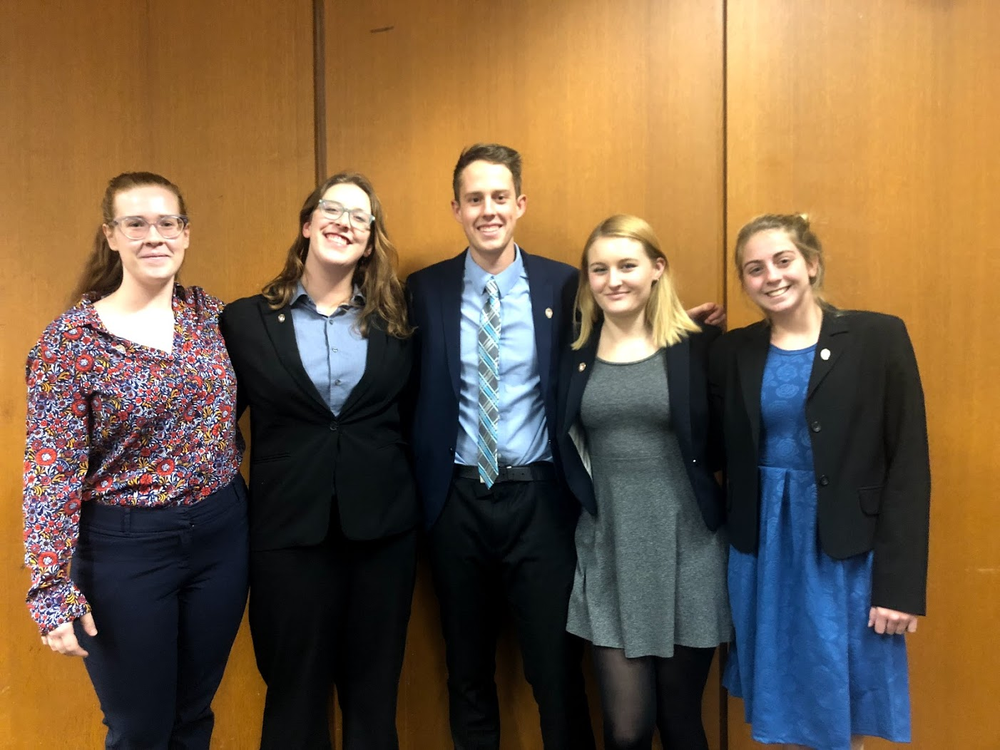

<h1 style="text-align:center">Sara Rabon</h1>
<h1 style="text-align:center">Welcome to my professional website!</h1>

___

## Work Experience

__IT Intern on the MDM: Data Migration Team__  
__3M__  
St.Paul, MN   
_May 2019 - Present_  

__Undergraduate Research Assistant__  
__Center for Healthy Minds__  
Madison, WI  
_September 2018 - Present_  
I spend most of my time at the Center creating psych tasks online for experiments and research. The Center has switched to new psych software recently, so it has been my job to transform old tasks to fit in the new software. On top of that, I also work to create new ways to teach the software to unfamiliar employees. Once experiments have been run, I have written numerous scripts to clean and analyze large amounts of data gathered from the experiments. 

__Student IT Technician__  
__UW-Madison Science Hall Help Desk__  
Madison, WI  
_Feburary 2019 - Present_  
Working for the service desk at Science Hall has me opening and answering tickets for students and faculty in the building. Each ticket request allows me to test and grow my computer science skills. During downtime, I would work on replacing parts and setting up lab computers.

__Sales Supervisor__  
__Event Network, Inc.__  
St.Paul, MN  
_May 2017 - August 2017_  
Moving to a more managerial position was a natural progression from my time at Ace Hardware. I opened and closed the store several days a week while keeping track of inventory and employees during the day. Since I was contracted to work at a seasonal exhibit for the Science Museum of Minnesota, I engaged with a wide array of ages and enjoyed learning new things as much as the customers.  

__Sales Associate__  
__Ace Hardware Corporation__  
Lakeville, MN  
_July 2014 - August 2016_  
I spent most of my time interacting with customers, so I became the first and last face they saw when coming into the store. I always greeted with a smile and helped get customers to the right place or right people, and then I would check them out and make sure they had everything they required. On busier days, I would double as a sales associate and inform each patron on how their specific needs could be satisfied.  

___

## Education

__University of Wisconsin - Madison__  
Bachelor of Science in Computer Science, Communication Arts (Communication Science and Rhetorical Studies)  
_September 2016 - May 2020_

__Extracurriculars:__  

I currently am a member and former team captain of the UW-Madison Ethics Bowl Debate Team, sponsored by the [Holtz Center](https://sts.wisc.edu/2018/09/04/holtz-center-sponsors-uw-madison-ethics-bowl-team/). We placed [3rd in 2017](https://sts.wisc.edu/2017/12/05/uw-madison-ethics-bowl-team-headed-to-nationals-in-march/) and 1st in 2018 at the Upper Midwest Regionals, and particpated in Nationals in 2018 and 2019.

 
Ethics Bowl is a form of debate run by The Association for Practical and Professional Ethics (APPE) where students from all over the country come together to defend practical ethical stances on issues ranging from automation to genetics. The program encourages impromptu speaking as well as critical thinking and team work. Each year, the top 32 teams from over 15 regionals around the country particpate in Nationals to be the best team in the country.  
[The Team's WIN Page](https://win.wisc.edu/organization/e-bowl)  
[The Team's Facebook Page](https://www.facebook.com/groups/1867389600177091/)

I particpated in the Communication Arts Student Association (CASA) from January 2017 to May 2018. During that time, I spent a year as the Academic Chair of the student organization. I managed the relationship between the organzation and the department and shaped the image of the major projected to students inside and outside the department.  
[CASA WIN Page](https://win.wisc.edu/organization/casa)  
[CASA Facebook Page](https://www.facebook.com/CASAUW/)  

___

## Projects

Coming soon! 
___

## Links
[Github](https://github.com/skrabon)  
[Kaggle](https://www.kaggle.com/srabon)

